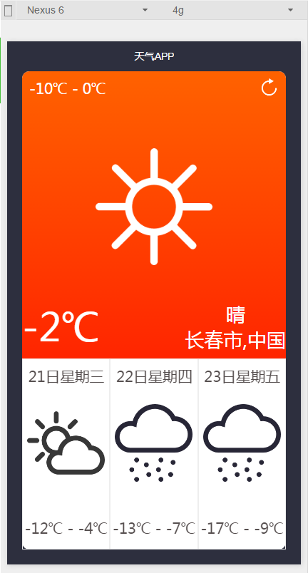

##### 对微信小程序的初尝试  
***
项目的源实例来源于csdn学院课堂，除去了冗余部分，增加了百度地图和某不知名的天气API（找了好久找到的非常好用的一个免费天气API）的调用。  
***
主要功能点：  
* 微信API的调用：发HTTP请求，获取位置，toast提示等  
* 百度地图API的调用：根据经纬度获取具体地点，源码中AppKey是我自己的key，使用时需替换  
* 天气API的调用：获取今天和未来四天的天气，处理json结果并展现在页面上  
* 微信官方组件scrollview等布局组件的使用

效果截图：  
  

使用方法：  
用微信web开发者工具新建项目指向项目文件夹即可  

